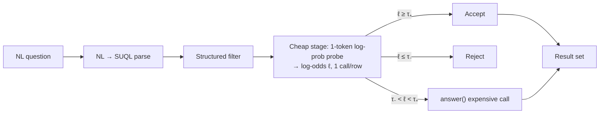
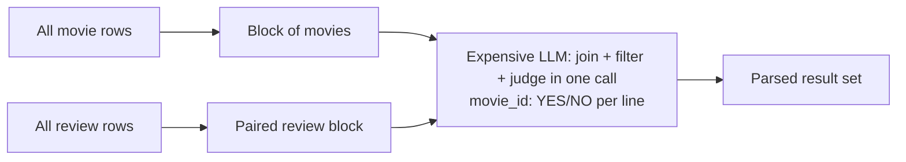
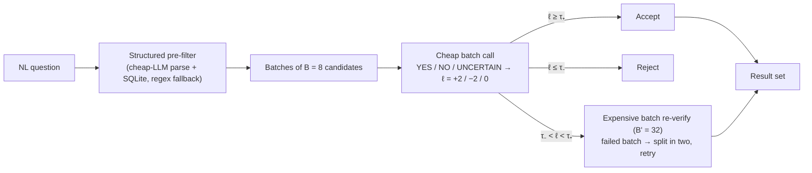
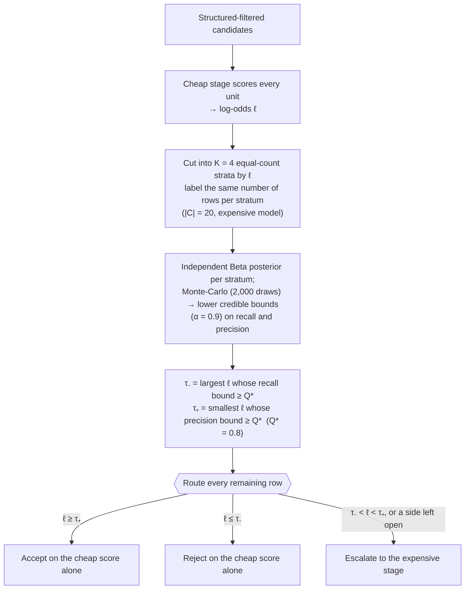
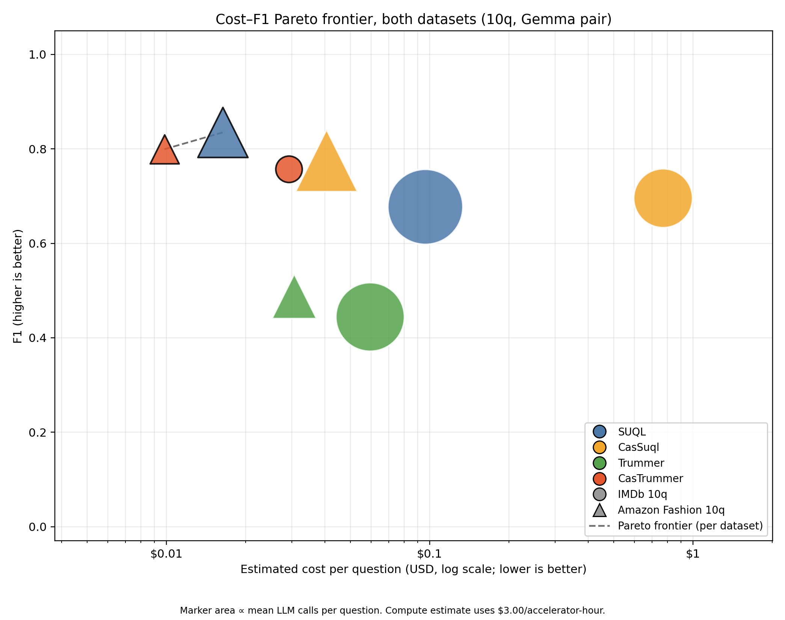

# Cost-Bounded Cascaded Semantic Query Execution

A benchmark of four ways to answer natural-language questions that mix a
**structured predicate** (year, price, genre, brand, ...) with a **semantic
predicate** judged from free text (a review, a plot summary) — evaluated
identically on two unrelated domains, **IMDb movies** and **Amazon Fashion
product reviews**. The four methods are **Suql**, **CasSuql**, **Trummer** and
**CasTrummer**; the two `Cas*` methods add a calibrated cheap→expensive cascade
to the semantic operator of the other two. This is the code, data, and results
behind an EDBT 2027 submission
([`docs/edbt2027-paper/main.pdf`](docs/edbt2027-paper/main.pdf)).

> **Headline result.** On both datasets, **CasTrummer** issues 81–83% fewer LLM
> calls than Suql and improves the F1 of Trummer by 45–110%. On IMDb it is also
> the most accurate method, at Suql's wall-clock time; on Amazon Fashion it is
> the cheapest in time and dollars and trades a 14% loss in F1 for it. An
> ablation shows its quality gain comes mainly from the structured filter and
> the batched expensive verification. **CasSuql** preserves Suql's quality with
> a certified bound on what its cheap stage rejects and sends fewer rows to the
> expensive model, but it is slower on both datasets, because the cheap model
> is not faster per call than the expensive one (§4, §5).

---

## Table of contents

0. [Repository layout](#0-repository-layout)
1. [Datasets](#1-datasets)
2. [The four methods](#2-the-four-methods)
3. [Architecture: pipelines, prompts, semantic dictionary, cascade calibration, cost model](#3-architecture-pipelines-prompts-semantic-dictionary-cascade-calibration-cost-model)
4. [Experiments and results](#4-experiments-and-results)
5. [Conclusions](#5-conclusions)
6. [Setup and running](#6-setup-and-running)

---

## 0. Repository layout

Two self-contained dataset trees (`imdb/`, `amazon/`) share the same four
method implementations, the same suite/runner scripts, and the same output
schema, so results are directly comparable across domains.

```text
SemanticCascadedLLMJoins/
├── README.md                    this file
├── plots/                       the paper's cost-vs-F1 Pareto figure: cost_f1_pareto_both_datasets.png,
│                                plus the per-dataset versions imdb_cost_f1_pareto.png, amazon_cost_f1_pareto.png
├── paper_outputs/               tables, Pareto plots, Trummer ablation and run notes behind the paper (§4)
├── docs/
│   ├── edbt2027-paper/          EDBT 2027 submission (LaTeX, figures, main.pdf)
│   ├── papers/                  reference papers (SUQL, ELEET, Stretto, ...)
│   ├── presentations/           slide decks from project milestones
│   └── eda/                     dataset ETL plots + scripts backing §1
│
├── imdb/
│   ├── data/
│   │   ├── sources/              downloaded title.basics/title.crew/name.basics + review split
│   │   ├── canonical/            reconstructed structured + review tables (§1)
│   │   ├── benchmark_union/       deduplicated union of all benchmark records
│   │   └── subdatasets/<suite>/   per-question CSVs, annotations, ground truth
│   ├── approaches/
│   │   ├── project SUQL/{baseline,v1}/      Suql, CasSuql (§2-3)
│   │   └── project Trummer/{baseline,v1}/   Trummer, CasTrummer (§2-3)
│   ├── benchmarks/
│   │   ├── {1q,3q,5q,10q}/        suite definitions + outputs
│   │   ├── shared/scripts/         run_method.py, evaluate_and_plot.py, common.py, ...
│   │   ├── semantic_dict/          the semantic-dictionary miner (§3.3)
│   │   └── multi_model_experiments/  earlier cross-model-pair summaries (§4.4)
│   └── experiments/imdb_5q_10rep/   earlier 4 model-pair runs (§4.4)
│
└── amazon/
    ├── products.csv, reviews.json, *.json.gz   raw McAuley-Lab source
    ├── canonical/                 structured.csv, texts.csv, schema.json (§1)
    ├── approaches/                 ported copy of imdb/approaches/ (Amazon schema, §2-3)
    ├── benchmarks/
    │   ├── {1q,3q,5q,10q}/          suite definitions + outputs
    │   ├── scaling/                 earlier candidate-pool-size scaling study (§4.4)
    │   └── shared/scripts/          symlinked/mirrored from imdb/benchmarks/shared
    ├── experiments/                earlier 4 model-pair runs and a seed check (§4.4)
    └── archive_generalized_pipeline_results/  pre-port results — NOT comparable, see §4.4
```

**Method names vs. code identifiers.** The paper and this README call the
methods **Suql, CasSuql, Trummer, CasTrummer**. The code, CLI flags, directory
names and raw `aggregate.csv` files keep the original identifiers:

| Paper name | Code identifier (`--methods`) | Implementation |
|---|---|---|
| Suql | `suql_baseline` | `approaches/project SUQL/baseline/` |
| CasSuql | `suql_v1` | `approaches/project SUQL/v1/` |
| Trummer | `trummer_baseline` | `approaches/project Trummer/baseline/` |
| CasTrummer | `trummer_v1` | `approaches/project Trummer/v1/` |

(Raw outputs may also spell them `suql_v1_two_level_cascade`,
`trummer_baseline_adaptive_block_join`, `trummer_v1_structured_two_level_cascade`.)

**A note on staleness.** `imdb/benchmarks/README.md` and `amazon/README.md`
are narrower, per-directory docs that still use the old identifiers and in
places point at superseded run directories (the Amazon side in particular still
describes the deleted `generalized_pipeline/` implementation). Treat **this
file** and the paper as canonical; §4 says which runs are current.

---

## 1. Datasets

Both datasets are reduced to the same shape: a **structured table** `S` (one
row per entity) and a **free-text table** `U` (one or more text rows per
entity), joined on an ID. Each benchmark question is then evaluated on its own
**pool of 100 candidates**. Ground truth is defined by the structured predicate
together with hand-authored regular-expression patterns encoding the semantic
condition — no LLM acts as a judge — so a correct paraphrase outside the
patterns counts as a negative, and absolute F1 values are best read as
comparisons between methods.

| | IMDb | Amazon Fashion |
|---|---|---|
| Source | `title.basics` / `title.crew` / `name.basics` joined to the Stanford/IMDb sentiment train split ([`provenance.json`](imdb/data/canonical/provenance.json)) | 2018 McAuley Lab release, full category (not the 5-core subset: 31 products, too few ground-truth matches) |
| Structured table `S` | 431,917 movies: `movie_id, title, director, year, runtime, genres` | 186,105 products: `title, brand, category, price, description, features, sales_rank` |
| Text table `U` | 25,000 reviews, one per movie of the joined table | 882,321 reviews |
| Median review length | 979 characters | 88 characters |
| Pool per question | 12 answers, 28 rows satisfying only `σ_S`, 30 only `σ_U`, 30 neither (40 pass `σ_S`) | 50 products satisfy `σ_S`, 15 of them answers |
| Questions (`10q`) | 10 questions over 7 genres: one or two structured conditions (genre, year, runtime) + one semantic condition, from direct cues (*funny*) to paraphrase-prone ones (*chemistry*, *approval of a twist*) | 10 held-out questions: a product type (via the title) + a property described in the reviews |

Two data facts worth knowing before reading the results:

- **IMDb** review scores are only 1–4 and 7–10 (neutral 5–6 are excluded from
  the source split); the 25,000-review split is exactly balanced 12,500
  positive / 12,500 negative.
- **Amazon** structured metadata is sparse: `price` is populated for under 10%
  of products, `description` for under 9%, and `category` is 100% empty — the
  category signal lives inside the free-text `sales_rank` field, which the
  structured parser has to extract. Reviews are short and skew positive (52.6%
  five-star, 94% verified purchases), so the semantic judge sees far less
  evidence per item than on IMDb. Both Amazon tables carry a stable 70/30
  dictionary/evaluation split (`_split` column), so held-out questions cannot
  leak into whatever built the benchmark pools.

Full-corpus ETL plots (decade, runtime, genre, review length, field
completeness, ratings, ...) and the scripts that regenerate them are in
[`docs/eda/`](docs/eda/) (§6). Pools are built by
`imdb/benchmarks/build_suites.py` and `amazon/benchmarks/build_subdatasets.py`;
each pool ships an `annotations.csv` (label derivation, evidence excerpt) that
is metadata only and never read by the implementations under test.

---

## 2. The four methods

### 2.1 Query model

A question is `Q = (σ_S, σ_U)`: a **structured predicate** `σ_S` over the
attributes of `S`, answerable in a DBMS, and a **semantic predicate** `σ_U`
over the text in `U`, delegated to an LLM. Its answer is the set of ids that
satisfy both:

```text
Ans(Q) = π_id( σ_S(S) ⋈_id σ_U(U) )
```

All methods rely on two properties of this model:

- **Independence.** The predicates are evaluated on disjoint evidence (`σ_S` on
  `S`, `σ_U` on the text), so their selectivities can be estimated separately
  and the operators ordered.
- **Asymmetric cost.** `σ_S` is cheap in any DBMS; `σ_U` needs one or more LLM
  calls. Every method tries to cut the number of LLM calls spent on `σ_U`
  without losing the quality of `Ans(Q)`.

The first step, **predicate extraction**, maps the natural-language question to
the pair `(σ_S, σ_U)`; the paper treats it as a black box shared by all four
methods and assumes `Q` is given. In this code base the step is implemented per
method (§3.1): Suql parses to a SUQL string with its expensive model, and
CasTrummer's structured filter uses the cheap model with a regex fallback.

### 2.2 Methods

| Method | Structured filter first? | Semantic execution of `σ_U` | LLM tiers |
|---|---|---|---|
| **Suql** | Yes (`WHERE` clause in a DBMS) | One `answer()` call **per candidate row**, full text | expensive only |
| **CasSuql** | Yes | Cheap single-token log-probability score per row; only rows inside the ambiguity band reach `answer()` | cheap + expensive |
| **Trummer** | **No** | Block nested-loop join: each call gets one block of each collection and must match, filter and judge | expensive only |
| **CasTrummer** | Yes (added) | Batched cheap `YES/NO/UNCERTAIN` pass, batched expensive verification of the rows inside the band | cheap + expensive |

**Suql** compiles `σ_S` into a `WHERE` clause and runs it in a DBMS, giving the
candidates `R_σ = σ_S(S)`. Each candidate is then judged once through
`answer(txt, question)` → `YES`/`NO`, for `O(|R_σ|)` calls. Every row is
judged alone and with its full text, so quality is close to the best
achievable — but cost grows with the number of candidates and cannot be
reduced, since no work is shared across rows.

**Trummer** applies no structured filter. The two relations are kept as
separate collections, partitioned into blocks, and each call receives one block
of each, like a block nested-loop join; the block size is adapted to the
model's context budget (4,096 tokens). The model returns one `id: YES/NO` line
per candidate. Calls drop roughly by the block size, but the model must now do
three things in one call: match rows across the blocks by id, evaluate `σ_S`
without a query engine, and evaluate `σ_U`. This is the main cause of Trummer's
quality loss: as rows per call grow, each gets less attention and the model
leans on the structured condition alone or on superficial keyword matches.

**CasSuql** and **CasTrummer** both add a *cheap stage → routing → expensive
stage* cascade on top of the corresponding baseline. A cheap stage scores every
**unit** (a single row for CasSuql, a batch of rows for CasTrummer); rows it is
confident about are resolved immediately, and only rows inside a calibrated
ambiguity band are escalated. Each LLM call processes one batch, but the routing
decision is made per row (§3.4).

- **CasSuql** (row-level cascade, batch size 1): after the structured filter,
  the cheap stage scores each row with a single-token log-probability (read from
  Ollama's native token log-probs). Rows outside the band are resolved without
  another call; rows inside it get Suql's full `answer()` call. Its expensive
  calls are therefore a subset of Suql's — it never issues more expensive calls
  than Suql, and the calibration rows keep their expensive answer, so no row is
  judged twice. Its wall-clock time can still be higher, because the cheap
  stage's latency is pure overhead (§3.5).
- **CasTrummer** (batch-level cascade) changes three things relative to
  Trummer: **(1)** `σ_S` runs in the DBMS before any LLM call, so no context is
  spent on rows the DBMS rejects for free; **(2)** the surviving rows go in
  batches of `B = 8` to a cheap call that returns `YES`, `NO` or `UNCERTAIN` per
  row (mapped to log-odds `ℓ = +2, −2, 0`), so rows with indirect evidence are
  escalated instead of defaulting to `NO`; **(3)** rows inside the band
  (typically the `UNCERTAIN` ones) are re-verified by the expensive model in
  batches of `B' = 32`; if a batch answer is unusable (a long prompt overflows
  the context and ids go missing), the batch is split in two and each half is
  retried — every retry counts as an expensive call — so no candidate is
  silently dropped. Running `σ_S` first follows the classical rule for
  expensive selections (order operators by ascending `c_i / (1 − s_i)`), since
  `σ_S` is both inexpensive and typically very selective.

---

## 3. Architecture: pipelines, prompts, semantic dictionary, cascade calibration, cost model

### 3.1 Pipelines


**Suql** ([`suql_engine.py`](<imdb/approaches/project SUQL/baseline/suql_engine.py>)):
one expensive-LLM call parses the question into a SUQL string (SQL +
`answer()` predicates); the SQL part runs against an in-memory SQLite table;
every surviving row gets exactly one expensive `answer()` call, no batching.


**CasSuql** ([`cascade_filter.py`](<imdb/approaches/project SUQL/v1/cascade_filter.py>),
[`scorer.py`](<imdb/approaches/project SUQL/v1/scorer.py>)): identical parse and
structured filter; `answer()` is executed through the cascade instead of
directly.



**Trummer** ([`operators.py`](<imdb/approaches/project Trummer/baseline/trummer_join/operators.py>)):
**no structured pushdown** — the full candidate pool must be covered. Movie rows
and review rows are partitioned into blocks (block size adapted to the
4,096-token context) and paired; each pair goes to the expensive model in one
call that must both **join** (recover row identity from serialized text) and
**judge** the structured and semantic predicates.



**CasTrummer** ([`cascade.py`](<imdb/approaches/project Trummer/v1/trummer_join/cascade.py>),
[`structured_filter.py`](<imdb/approaches/project Trummer/v1/trummer_join/structured_filter.py>)):
structured pre-filter, then the batched cheap pass, then band routing, then
batched expensive verification.



### 3.2 Prompts (excerpts, with source)

Full prompts are in the linked files; `[...]` marks omitted text. The Suql
`answer()` judge is a recall-first YES/NO instruction over `Review` +
`Question`
([`suql_engine.py`](<imdb/approaches/project SUQL/baseline/suql_engine.py>)), also
used as CasSuql's expensive fallback.

**CasSuql cheap scorer** — a raw completion prompt (no chat roles), so the
`1`/`0` token log-probs can be read directly
([`scorer.py`](<imdb/approaches/project SUQL/v1/scorer.py>)):

```text
Act as a high-recall first-pass semantic filter. Decide whether this review
contains review-specific evidence for a Yes answer. Count direct wording,
synonyms, described examples, and reasonable implications as evidence. [...]
Return exactly one token: 1 for Yes, 0 for No.

{guidance_block}
Question: {question}
Review: {review[:1800]}

Answer:
```

**Trummer block-join predicate** — one call judges an entire block pair
([`operators.py`](<imdb/approaches/project Trummer/baseline/trummer_join/operators.py>)):

```text
Find every movie in Collection 1 that has a review in Collection 2
satisfying this predicate: {predicate}
Act as a recall-first semantic filter, while requiring review-specific evidence.
[...evidence-retrieval rules, same in spirit as the Suql judge...]
A review belongs to a movie only when tconst is exactly equal to movie_id.
Return one decision per line as: movie_id: YES or movie_id: NO.
Collection 1: {block_1_rows}
Collection 2: {block_2_rows}
Decisions:
```

**CasTrummer cheap batch prompt** — a three-way label instead of a continuous
score ([`cascade.py`](<imdb/approaches/project Trummer/v1/trummer_join/cascade.py>)):

```text
Act as a high-recall first-pass semantic filter.

Answer YES for direct evidence, synonyms, described examples, or reasonable
implications. Answer UNCERTAIN when evidence is condition-specific but too weak or
ambiguous for a reliable YES. Answer NO only when review-specific support is absent,
generic, based only on genre/topic, or never discusses the predicate itself. [...]
Prefer UNCERTAIN over NO when plausible condition-specific evidence exists.
```

Every one of these prompts is assembled with a `guidance` block injected at
render time — the semantic dictionary.

### 3.3 The semantic dictionary

An implementation detail not covered in the paper. [`imdb/benchmarks/semantic_dict/`](imdb/benchmarks/semantic_dict/)
mines a **prompt-context artifact**, not a keyword classifier — its `threshold`
field is enforced to always be `null`
([`semantic_dict_loader.py`](imdb/benchmarks/semantic_dict/semantic_dict_loader.py)).
10 categories (`categories.json`: e.g. `recommend_general`, `praise_humor`,
`criticize_pacing`) are each mined from a stratified 5,000-review sample, split
**70% mining / 30% holdout** — holdout text is never read again after the split
(`MINING_FRACTION = 0.70`,
[`mine_semantic_dict.py`](imdb/benchmarks/semantic_dict/mine_semantic_dict.py)).
Each category record holds log-odds-scored lexical anchors, few-shot
**positive** and **hard-negative** exemplars (chosen by k-means++ over
sentence-transformer embeddings), and a `template_type`
(`recommend | praise | describe | criticize`).

At runtime `semantic_guideline(question)` maps the question to a category via
lexical markers and renders an *"advisory prompt context, not a keyword rule"*
block, with an explicit instruction to *"judge only the current review... never
treat an exemplar as current evidence."* It is injected into every semantic
judge prompt across all four methods, and **not** into the structured NL→SQL
parsers.

### 3.4 Cascade calibration (shared by CasSuql and CasTrummer)

The cheap stage returns a probability `p ∈ (0, 1)` per row (CasTrummer's labels
map directly to `ℓ = +2 / −2 / 0`), converted to log-odds
`ℓ = log(p / (1 − p))`. Rows are routed by an ambiguity band `(τ₋, τ₊)`
calibrated **per question** from a small labeled calibration set:



**Calibration set.** `C` is `|C| = 20` rows sampled from the candidates `R_σ`,
stratified by cheap score and labeled by the expensive LLM. The labeled rows
**keep their expensive answer** as their final answer, so no row is judged
twice.

**Beta-posterior bounds.** Existing approaches calibrate thresholds on large
validation sets (statistical accuracy guarantees, isotonic regression, learned
proxy scores, learned routing); here the threshold must be re-fit for every
question from only the rows in `C`, so recall and precision of the cheap stage
are modeled with Beta posteriors, which are closed-form for any sample size and
stay conservative when `|C|` is small. For a threshold `τ`, with `TP, FN, FP`
counted on `C` and a uniform `Beta(1,1)` prior, recall has posterior
`Beta(1+TP, 1+FN)` and precision `Beta(1+TP, 1+FP)`. Their lower credible bounds
at level `α = 0.9` give

```text
τ₊ = min { τ : p̂_α(τ) ≥ Q* }      (precision bound clears the target → accept)
τ₋ = max { τ : r̂_α(τ) ≥ Q* }      (recall bound clears the target → reject)
```

Above `τ₊` the precision is high enough to accept on the cheap score alone;
below `τ₋` the recall is high enough to reject; in between the row is escalated.

**Stratified estimation.** Because `C` is sampled across the range of cheap
scores rather than uniformly, the counts cannot be read directly from it. The
candidates are cut into `K = 4` equal-count strata by cheap score (equal scores
never straddle a cut); the same number of rows is labeled in each stratum, and an
independent Beta posterior is placed on each stratum's positive rate. The recall
and precision bounds come from propagating these posteriors to the unlabeled
rows of each stratum by Monte-Carlo sampling (2,000 draws), the labeled rows
contributing their known answer; with one stratum they reduce to the bounds
above. The thresholds are the boundaries of the largest prefix (resp. suffix) of
strata that clears `Q*`, and **a side that no stratum clears is left open**
(`τ₊ = +∞` or `τ₋ = −∞`), so all rows on that side are escalated rather than
decided by an unverified cheap stage. The implementation is
[`band_fit.py`](<imdb/approaches/project Trummer/v1/trummer_join/band_fit.py>)
(CasTrummer; CasSuql has its own copy in `project SUQL/v1/`).

**Target and power.** The target is `Q* = 0.8`, because `0.9` cannot be certified
from 20 labels: a cheap stage that is correct on all of them has a lower bound of
only 0.896. In simulations (300 pools per configuration, 40–1,000 rows, 10–30%
positives, cheap-score AUC 0.76–0.96, `|C| ∈ {20, 40, 100}`), the true recall of a
certified reject region reached `Q*` in at least 99% of the trials, against a
target of 90%. The price is power: with `|C| = 20` the cheap stage decides on its
own only 8–13% of the rows, and 28–36% with `|C| = 40`.

### 3.5 Cost model

LLM calls dominate cost; the structured filter and the join on `id`, run by a
DBMS, are negligible. With `N = |S|`, one text per item, and `s ∈ (0, 1]` the
selectivity of `σ_S` (so `|R_σ| = sN`):

| Method | LLM calls |
|---|---|
| Trummer | `O(N² / (b_S · b_U))` — a block nested-loop join, **quadratic in `N` and independent of `s`** (no structured filter) |
| Suql | `O(sN)` — one call per candidate |
| CasSuql | `O(sN)` cheap + `O(e·sN)` expensive, with `e ∈ [0, 1]` the fraction escalated |
| CasTrummer | `O(sN / B)` cheap + `O(e·sN / B')` expensive |

Both cascades also label a calibration set with the expensive model, but those
rows keep their answer. In wall-clock time CasSuql pays `t_c` per row for the
cheap call and `t_e` for the escalated rows, against `t_e` per row for Suql, so
it is faster **exactly when `t_c / t_e < d`**, where `d = 1 − e` is the fraction
of rows the cheap stage decides alone.

---

## 4. Experiments and results

### 4.1 Setup

- **Models.** All methods use the same two open-weight models, served with
  Ollama on one NVIDIA H200 at temperature 0: **Gemma 4 e2b** (cheap) and
  **Gemma 4 26b** (expensive). The two baselines use only the expensive model.
- **Batch sizes.** Suql and CasSuql: one row per call. CasTrummer: `B = 8`
  (cheap), `B' = 32` (expensive). Trummer: block sizes chosen by its own
  optimizer to fit a 4,096-token context.
- **Calibration.** Both cascades: `|C| = 20` rows per question, `K = 4` strata,
  `α = 0.9`, `Q* = 0.8` (§3.4).
- **Review truncation.** CasSuql cheap stage 1,800 characters; both CasTrummer
  stages 3,500; CasSuql's expensive stage keeps Suql's 6,000; Trummer uses 1,400.
  The same limits are used on Amazon, whose reviews are much shorter.
- **Metrics.** Precision, recall and F1 of the returned id set against the ground
  truth; number of LLM calls (cheap vs. expensive); wall-clock time; estimated
  dollar cost from accelerator time at $3 per hour. Each method runs **10
  repetitions per question**; tables report the mean ± standard deviation over the
  ten questions of the per-question mean. Since every call uses temperature 0, the
  repetitions differ only in the calibration sample.

### 4.2 Main results (`10q`, Gemma pair)

**IMDb**
([`imdb_10q_10rep_fixed_gemma4_e2b_26b/`](imdb/benchmarks/10q/outputs/imdb_10q_10rep_fixed_gemma4_e2b_26b/)):

| Metric | Suql | CasSuql | Trummer | CasTrummer |
|---|---:|---:|---:|---:|
| Precision | 0.818 ± 0.213 | **0.830 ± 0.196** | 0.620 ± 0.313 | 0.779 ± 0.186 |
| Recall | 0.400 ± 0.207 | 0.400 ± 0.203 | 0.275 ± 0.193 | **0.708 ± 0.189** |
| F1 | 0.501 ± 0.168 | 0.500 ± 0.153 | 0.340 ± 0.182 | **0.713 ± 0.131** |
| Wall time (s) | **24.74 ± 0.92** | 46.98 ± 2.36 | 25.39 ± 2.59 | 25.65 ± 2.64 |
| LLM calls | 40.00 ± 0.00 | 77.95 ± 2.84 | 10.50 ± 1.27 | **7.56 ± 0.69** |

**Amazon Fashion**
([`amazon_10q_10rep_fixed_gemma4_e2b_26b/`](amazon/benchmarks/10q/outputs/amazon_10q_10rep_fixed_gemma4_e2b_26b/)):

| Metric | Suql | CasSuql | Trummer | CasTrummer |
|---|---:|---:|---:|---:|
| Precision | 0.820 ± 0.115 | **0.839 ± 0.113** | 0.565 ± 0.200 | 0.755 ± 0.285 |
| Recall | **0.807 ± 0.254** | **0.807 ± 0.234** | 0.473 ± 0.260 | 0.647 ± 0.325 |
| F1 | 0.779 ± 0.142 | **0.796 ± 0.133** | 0.464 ± 0.187 | 0.673 ± 0.294 |
| Wall time (s) | 29.03 ± 2.05 | 53.05 ± 2.93 | 24.02 ± 5.42 | **23.19 ± 8.37** |
| LLM calls | 49.40 ± 0.52 | 92.00 ± 3.74 | 9.00 ± 2.36 | **8.24 ± 2.95** |
| $-cost | 0.0242 ± 0.0017 | 0.0442 ± 0.0024 | 0.0200 ± 0.0045 | **0.0193 ± 0.0070** |

Bold = best in the row. Source tables, aggregates and run notes:
[`paper_outputs/`](paper_outputs/).

**Cost–F1 trade-off.** The figure places the four methods in the cost–F1 plane
(IMDb = circles, Amazon Fashion = triangles; `10q`, Gemma pair; dollar cost from
accelerator time at $3/hour).



Per-dataset versions: [`imdb_cost_f1_pareto.png`](plots/imdb_cost_f1_pareto.png),
[`amazon_cost_f1_pareto.png`](plots/amazon_cost_f1_pareto.png).

- **IMDb.** CasTrummer is the most accurate method (F1 0.713 vs. 0.501 for the
  next best, Suql) at a dollar cost within 4% of the cheapest, and it uses the
  fewest LLM calls; CasTrummer and Suql form the Pareto front, Trummer and
  CasSuql are dominated. Against Trummer it improves F1 by about 110%, mostly
  through recall (0.275 → 0.708), on all ten questions (paired difference
  +0.373 ± 0.076), with 28% fewer calls at the same wall time. CasSuql
  reproduces Suql's quality (F1 0.500 vs. 0.501, same recall of 0.400) while
  sending 5% fewer rows to the expensive model, but its wall time is 1.9× higher.
- **Amazon Fashion.** The quality gap among the three methods that apply `σ_S`
  is narrower: Suql, CasSuql and CasTrummer reach F1 between 0.67 and 0.80, and
  CasSuql is the most accurate (0.796 vs. 0.779, same recall of 0.807).
  CasTrummer is the cheapest method in calls (83% fewer than Suql), wall time and
  dollars; the Pareto front also contains Suql and CasSuql, which reach a higher
  F1 at a higher cost. Against Trummer it raises F1 by 45% (better on nine of ten
  questions, paired difference +0.209 ± 0.057), improving both precision
  (0.565 → 0.755) and recall (0.473 → 0.647). On one question its F1 is 0, which
  drives its large deviation. CasSuql costs 1.8× Suql's time for +0.017 F1.
- **Across datasets.** Relative to Suql, the strongest baseline, CasTrummer cuts
  LLM calls by **81.1% on IMDb and 83.3% on Amazon**, and wall-clock time by 20.1%
  on Amazon (on IMDb it is 3.7% higher). The call reduction carries over from one
  domain to the other; the quality gain does not: F1 **+42.3% on IMDb, −13.6% on
  Amazon**.

### 4.3 Where the gains come from

**Calibrated band is conservative.** With `|C| = 20` labels, CasSuql certified a
band in 34% (IMDb) and 77% (Amazon) of its repetitions, and CasTrummer in 18% and
7%. Averaged over all repetitions, the cheap stage decided on its own 2.0 of 40
(IMDb) and 7.4 of about 50 (Amazon) rows for CasSuql, and 1.4 and 0.9 for
CasTrummer. In every repetition in which CasSuql rejected rows (34 of 34 and 77
of 77), the certified recall bound was at least `Q* = 0.8`. Each pool has only 40
or about 50 candidates, so the 20 calibration rows are 40–50% of a pool, which
limits what the cheap stage can decide alone.

**CasTrummer ablation.** To separate the cheap stage from the rest, CasTrummer
was run with an empty calibration set (`--calibration-budget 0`), so every row
passing `σ_S` is verified by the expensive model in batches (same code, models,
10 repetitions;
[`imdb_10q_10rep_control_nocalib_trummer_v1/`](imdb/benchmarks/10q/outputs/imdb_10q_10rep_control_nocalib_trummer_v1/),
[`amazon_10q_10rep_control_nocalib_trummer_v1/`](amazon/benchmarks/10q/outputs/amazon_10q_10rep_control_nocalib_trummer_v1/);
write-up in
[`paper_outputs/control_trummer_ablation.md`](paper_outputs/control_trummer_ablation.md)):

| Dataset | Variant | Precision | Recall | F1 | Wall (s) | Expensive calls |
|---|---|---:|---:|---:|---:|---:|
| IMDb | Trummer | 0.620 | 0.275 | 0.340 | 25.4 | 10.5 |
| IMDb | CasTrummer | 0.779 | 0.708 | 0.713 | 25.7 | 2.6 |
| IMDb | Control (no calibration) | 0.788 | 0.725 | 0.723 | 22.3 | 4.0 |
| Amazon | Trummer | 0.565 | 0.473 | 0.464 | 24.0 | 9.0 |
| Amazon | CasTrummer | 0.755 | 0.647 | 0.673 | 23.2 | 2.0 |
| Amazon | Control (no calibration) | 0.673 | 0.633 | 0.621 | 21.4 | 2.8 |

On IMDb the control is as accurate (F1 0.723 vs. 0.713; paired difference
−0.010 ± 0.035) and 3.4 s faster. On Amazon, CasTrummer is better by
0.052 ± 0.026 at similar recall, which cannot be separated from a batch-partition
effect. The no-calibration control already gains +0.38 F1 (IMDb) and +0.16
(Amazon) over Trummer, so CasTrummer's quality gain comes **mainly from the
structured filter and the batched expensive verification**; the calibrated cheap
stage adds a recall guarantee at an extra 1.8–3.4 s of wall time.

**Why CasSuql is slower.** A cheap call took 0.58 s against 0.62 s for an
expensive one on IMDb (0.55 vs. 0.59 s on Amazon), so `t_c / t_e ≈ 0.94`, while
the cheap stage decided at most `d = 15%` of the rows — far from the break-even
`t_c / t_e < d` of §3.5.

### 4.4 Earlier exploratory runs (not in the paper)

The repository still holds earlier runs that predate the calibration fixes
(stratified recall test, label reuse, native log-probs) and, for some, a fix for
a determinism bug (every call is at temperature 0 and the calibration draw used
to be deterministic, so "repetitions" reproduced each other exactly). They are
kept for provenance and are **not comparable** to §4.2–4.3, so do not cite them
as current:

- `imdb/benchmarks/10q/outputs/heldout_diverse_10q_10rep_gemma4_e2b_26b_kraken_20260722/`
  and the other superseded `10q` output directories;
- `imdb/experiments/imdb_5q_10rep/`, `amazon/experiments/amazon_5q_10rep/` and
  `imdb/benchmarks/multi_model_experiments/` — 5 questions × 10 repetitions across
  four model pairs (Gemma, Qwen, a Gemma/Qwen cross pair, Llama);
- `amazon/benchmarks/scaling/` — candidate-pool-size scaling on one question;
- `amazon/experiments/seed_verification/` — repetition-variance check;
- `amazon/archive_generalized_pipeline_results/` — results of the deleted
  `generalized_pipeline/` implementation.

---

## 5. Conclusions

CasSuql and CasTrummer execute the structured filter in the DBMS and add a
calibrated cheap stage in front of the semantic operators of Suql and Trummer.

- **CasTrummer** issues 81–83% fewer LLM calls than Suql and improves the F1 of
  Trummer by 45–110%. On IMDb it is also the most accurate method, at Suql's
  wall-clock time; on Amazon Fashion it is the cheapest in time and dollars and
  trades a 14% loss in F1 for it. An ablation shows the quality gain comes mainly
  from the structured filter and the batched expensive verification, not from the
  cheap stage itself.
- **CasSuql** preserves the quality and recall of Suql, with a certified bound on
  what its cheap stage rejects, and sends fewer rows to the expensive model — but
  it is slower on both datasets, because the cheap model is not faster per call
  than the expensive one.

**Limitations.** Absolute F1 values are best read as comparisons between methods,
since ground truth is defined by hand-authored patterns. Every pool has 40 or
about 50 structured candidates, i.e. one selectivity regime, and the 20
calibration rows are 40–50% of a pool, which limits how often the band certifies.
Only one model pair (Gemma 4 e2b / 26b) and ten questions per dataset are in the
paper's results.

**Future work.** A broader evaluation with more questions, domains and model
families — in particular model pairs with a larger latency gap between the cheap
and the expensive model, and candidate pools that are large relative to the
calibration set — together with a systematic study of the batch sizes used in the
joins and a generalization of the cascade to more than two stages.

---

## 6. Setup and running

**Prerequisites**: Python 3 and bash (a project-local `.venv` is created
automatically on first run), and either a local [Ollama](https://ollama.com)
server or access to the project's Aker/Kraken cluster for GPU runs. Method
selection uses the **code identifiers** of §0 (`suql_baseline`, `suql_v1`,
`trummer_baseline`, `trummer_v1`).

### IMDb, locally

```bash
git clone https://github.com/AnnaRemi/SemanticCascadedLLMJoins.git && cd SemanticCascadedLLMJoins

# Smoke test: 1-question suite, all four methods, one repetition
bash imdb/benchmarks/1q/run_local.sh --pull-models

# The 10-question suite used in the paper, 10 repetitions, default model pair
bash imdb/benchmarks/10q/run_local.sh --pull-models --repetitions 10

# Any suite, custom model pair and method subset (CasSuql + CasTrummer only)
bash imdb/benchmarks/10q/run_local.sh --repetitions 10 \
  --cheap-model gemma4:e2b --expensive-model gemma4:26b \
  --methods "suql_v1 trummer_v1"
```

`run_local.sh` creates `.venv/`, installs
[`imdb/benchmarks/requirements.txt`](imdb/benchmarks/requirements.txt) into it,
optionally pulls missing Ollama models (`--pull-models`), and writes
`aggregate.csv`, `comparison.csv`, and `plots/` under
`imdb/benchmarks/<suite>/outputs/<run-name>/`.

### Amazon Fashion, locally

Amazon needs one extra one-time step to materialize per-question CSVs from the
raw source before the suite runners will work (re-run it after editing
`amazon/questions_10q.json` or `amazon/config.json`):

```bash
python3 amazon/benchmarks/build_subdatasets.py
bash amazon/benchmarks/10q/run_local.sh --pull-models --repetitions 10
```

Flags and output layout are identical to the IMDb runner above — the two
`run_local.sh` entry points are the same script.

### On the Aker/Kraken cluster

```bash
AKER_HOST=kraken bash imdb/benchmarks/10q/run_aker.sh --repetitions 10 --pull-models
AKER_HOST=kraken bash amazon/benchmarks/10q/run_aker.sh --repetitions 10 --pull-models
```

`run_aker.sh` defaults `AKER_ROOT` to a fixed remote path; if your account's
remote layout differs (as is currently the case for some IMDb jobs on kraken),
pass `AKER_ROOT=/your/remote/path` explicitly. Use `--methods "..."`,
`--cheap-model`, `--expensive-model` the same way as locally; `--allow-cpu`
overrides the default GPU requirement.

### Reproducing the paper's runs

The paper's tables come from `10q` × 10 repetitions with `gemma4:e2b` /
`gemma4:26b`, `Q* = 0.8`, `α = 0.9`, `|C| = 20`, `B / B' = 8 / 32`, on one H200
(kraken jobs 207618 for IMDb and 207619 for Amazon). The ablation control is the
`trummer_v1` method alone with `--calibration-budget 0` (jobs 207620 and 207621).
Run notes and sanity checks are in
[`paper_outputs/RUN_NOTES.md`](paper_outputs/RUN_NOTES.md).

### Multiple repetitions and reproducibility

Every LLM call runs at temperature 0. Without a calibration seed, repeated runs
of a cascade are byte-identical — set `CALIBRATION_SEED` (done automatically
per repetition by `repetitions.py`) or the newer `GENERALIZED_CASCADE_SEED` to
get real repetition-to-repetition variance. Suql and Trummer have no calibration
step and are deterministic by construction regardless.

### Regenerating the dataset plots (§1)

```bash
python3 docs/eda/imdb/generate_plots.py
python3 docs/eda/amazon/generate_plots.py
```

Each script reads directly from `{imdb,amazon}/canonical/` and overwrites its own
`docs/eda/<dataset>/*.png` — no other inputs required.
